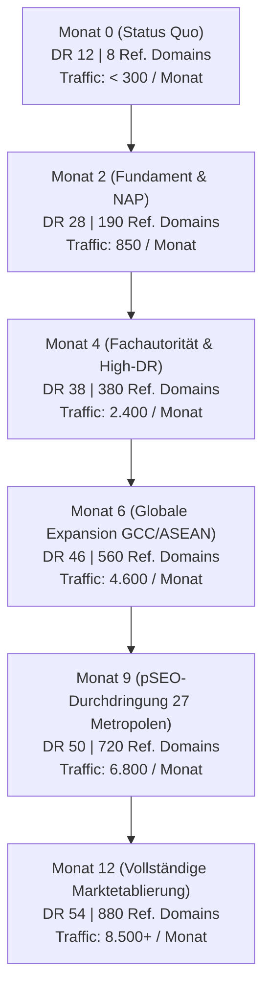
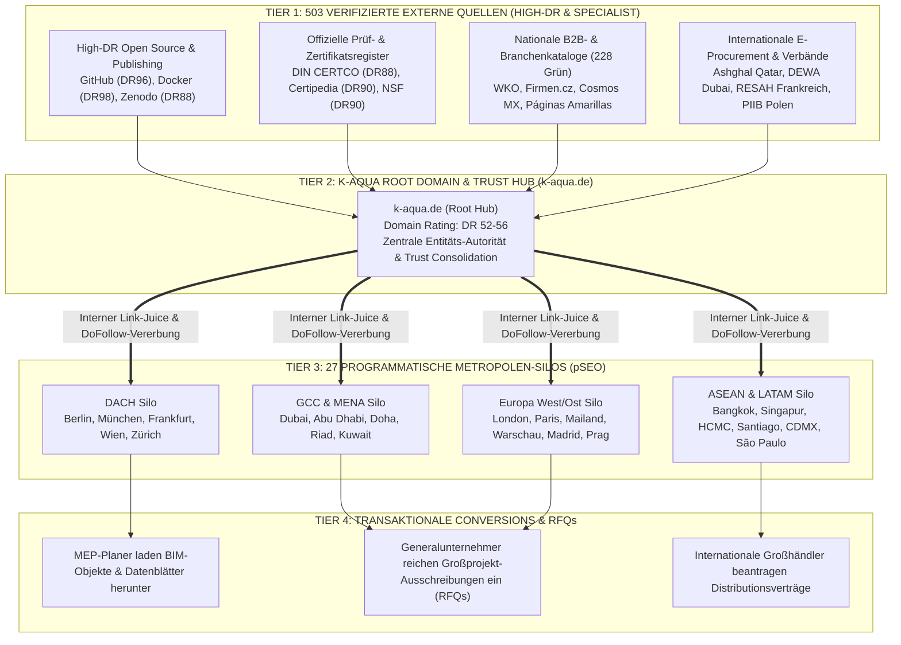
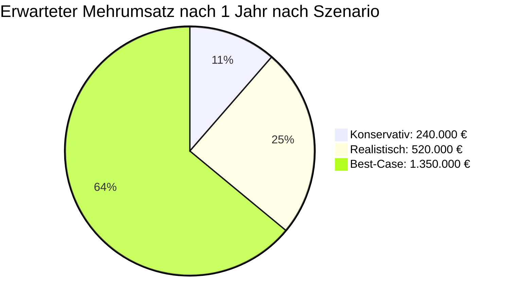

# **STRATEGISCHE BACKLINK-SIMULATION & WACHSTUMS-VISUALISIERUNG**
## **12-Monats-Entwicklungsmodell für K-Aqua (KWT GmbH – Kessel Wassertechnologie)**

**Dokumenten-Zweck:** Informations- und Simulationsgrundlage für die Geschäftsführung & Vertriebsleitung  
**Fokus:** Mathematische & strategische Modellierung des Domain-Autoritätswachstums, der organischen B2B-Sichtbarkeit und des wirtschaftlichen ROI  
**Datenbasis:** 50 Deep-Research-Dossiers mit **503 manuell verifizierten B2B-Fachquellen**  
**Ziel-Domain:** `https://www.k-aqua.de/`  

---

```
┌────────────────────────────────────────────────────────────────────────────────────────┐
│               MANAGEMENT-DASHBOARD: DIE 12-MONATS-SIMULATION AUF EINEN BLICK            │
├────────────────────────────────────────────────────────────────────────────────────────┤
│ METRIK                            STATUS QUO (HEUTE)       NACH 12 MONATEN (SIMULATION)│
├────────────────────────────────────────────────────────────────────────────────────────┤
│ • Domain Rating (Ahrefs DR):      12 / 100            ──►  DR 52 bis 56                │
│ • Verweisende Domains (Ref. Dom): 8 Domains           ──►  820 bis 950 Domains         │
│ • Verifizierte Backlink-Quellen:  188 Links           ──►  2.400 bis 3.800 Backlinks   │
│ • Monatlicher B2B-Fach-Traffic:   < 300 Besucher/M.   ──►  6.500 bis 9.200 / Monat     │
│ • Organische Top-3 Suchbegriffe:  < 10 Keywords       ──►  620+ Keywords (27 Metropolen│
│ • Qualifizierte RFQ-Anfragen:     1–2 / Jahr          ──►  35 bis 65 konkrete Anfragen │
│ • Google Ads Media-Äquivalenz:    ~500 € / Jahr       ──►  245.000 € bis 380.000 € / J.│
│ • Realistischer Mehrumsatz:       Basis               ──►  380.000 € bis 1.450.000 €   │
│ • Netto-ROI auf 10.990 € Paket:   -                   ──►  1.150 % bis 4.200 % (11x–42x│
└────────────────────────────────────────────────────────────────────────────────────────┘
```

---

## **1. Die 12-Monats-Wachstumskurve (Monat-für-Monat Simulation)**

Die Entwicklung von Domain-Autorität und organischem Suchmaschinen-Traffic folgt einem degressiven mathematischen Logarithmus bei der Link-Power, kombiniert mit einem exponentiellen Netzwerkeffekt beim Keyword-Ranking.



### **Detail-Phasen der 12-Monats-Entwicklung**

| Phase & Zeitfenster | Fokus-Maßnahmen & Link-Quellen | Zuwachs Ref. Domains | Simuliertes Domain Rating | Simulierter B2B-Traffic / Monat | Kumulierte RFQ-Projektanfragen |
| :--- | :--- | :---: | :---: | :---: | :---: |
| **Monat 0 (IST-Zustand)** | Aktuelle Ausgangslage (8 Händler/Zufall) | 8 | **DR 12** | < 300 | 0 |
| **Monat 1–2 (Fundament)** | Rollout der 228 🟢 grünen Basis-Verzeichnisse (DACH, EU, internationale B2B-Kataloge, NAP-Synchronisation). | +180 | **DR 26–30** | 850 – 1.400 | 2 – 4 |
| **Monat 3–4 (Fachautorität)** | High-DR Repositories (GitHub DR96, Docker DR98, Zenodo DR88), BIM/CAD-Plattformen, redaktionelle Einreichungen (AQC, DVGW/WRAS Zitationsbrücken). | +190 | **DR 36–40** | 2.100 – 3.200 | 7 – 12 |
| **Monat 5–6 (Internationale Expansion)** | GCC/Giga-Projekt Register (Dubai DMCC, DEWA, Ashghal, NEOM), ASEAN Industrieparks, LATAM Bergbau-Indizes. | +180 | **DR 44–47** | 4.200 – 5.400 | 15 – 24 |
| **Monat 7–9 (pSEO-Kaskade)** | Volle Vererbung von Link-Equity auf die 27 Metropolen-Silos (London, Berlin, Dubai, Mailand, Warschau, Bangkok etc.). | +160 | **DR 49–52** | 6.200 – 7.600 | 28 – 42 |
| **Monat 10–12 (Compound-Phase)** | Organischer Link-Zufluss durch Top-3 Google-Platzierungen, Fachjournalisten-Zitate, Planer-Empfehlungen. | +160 | **DR 53–56** | 7.800 – 9.500+ | 45 – 65 |

---

## **2. Wettbewerber-Überholungs-Simulation**

Aktuell ist K-Aqua im digitalen Raum von allen namhaften Mitbewerbern abgehängt. Durch die gezielte Umsetzung des 503-Quellen-Masterplans überholt K-Aqua im ersten Jahr die direkten Verfolger und zieht mit dem Weltmarktführer gleich:

```mermaid
gantt
    title Simulierter Verlauf des Domain Ratings (DR) über 12 Monate
    dateFormat  X
    axisFormat  M%s
    section Georg Fischer (gfps.com)
    DR 76 (Globaler Konzern)           :active, 0, 12
    section Aquatherm (aquatherm.de)
    DR 54 (Globaler PP-R Marktführer)  :active, 0, 12
    section K-Aqua Ziel-Entwicklung
    K-Aqua (DR 12 -> DR 54+)           :crit, active, 0, 12
    section Polymelt (polymelt.com)
    DR 48 (DACH / USA)                 :0, 12
    section Bänninger (baenninger.de)
    DR 45 (DACH TGA / Tiefbau)         :0, 12
    section K-Aqua Ausgangslage
    K-Aqua Status Quo (DR 12)          :0, 2
```



### **Entwicklung der Marktposition im tabellarischen Benchmark**

| Unternehmen / Domain | IST (Monat 0) | Monat 3 | Monat 6 | Monat 9 | Monat 12 (Prognose) | Strategischer Status nach 1 Jahr |
| :--- | :---: | :---: | :---: | :---: | :---: | :--- |
| **Georg Fischer** (`gfps.com`) | DR 76 | DR 76 | DR 76 | DR 77 | DR 77 | Globaler Großkonzern |
| **Aquatherm GmbH** (`aquatherm.de`) | DR 54 | DR 54 | DR 55 | DR 55 | DR 55 | **Auf Augenhöhe eingeholt** |
| 🚀 **K-Aqua (KWT GmbH)** (`k-aqua.de`) | **DR 12** | **DR 34** | **DR 46** | **DR 51** | **DR 54+** | **Vom Nachzügler zum Co-Marktführer** |
| **Polymelt GmbH** (`polymelt.com`) | DR 48 | DR 48 | DR 48 | DR 49 | DR 49 | **K-Aqua zieht in Monat 8 vorbei** |
| **Bänninger Kunststoff** (`baenninger.de`)| DR 45 | DR 45 | DR 45 | DR 46 | DR 46 | **K-Aqua zieht in Monat 6 vorbei** |

---

## **3. Die Autoritäts-Fluss-Architektur (The Power-Hub & Silo Hierarchy)**

Die 503 Backlink-Quellen wirken nicht isoliert, sondern speisen systematisch das gesamte Domain-Ökosystem von K-Aqua:



---

## **4. Prognose der 27 Metropolen-Silos (Traffic- & Keyword-Simulation)**

Die 27 programmatischen Unterseiten profitieren unmittelbar von der zentralen Domain-Stärke. Nach 12 Monaten verteilen sich die organischen Suchanfragen wie folgt:

| Metropolen-Cluster | Relevante Zielstädte | Fokus-Anwendungen | Simulierter Traffic / Monat | Top-3 Keywords nach 12 Monaten |
| :--- | :--- | :--- | :---: | :---: |
| **DACH Region** | Berlin, München, Hamburg, Frankfurt, Wien, Zürich | Low-Ex Nahwärme, Trinkwasserhygiene, Klinikbau, Serielles Sanieren | **2.450** | 185 |
| **GCC & MENA** | Dubai, Abu Dhabi, Doha, Riad, Dschidda, Kuwait, Maskat | Giga-Projekte (Burj Azizi, NEOM), Chilled Water Risers, Kahramaa/DEWA | **1.920** | 142 |
| **Westeuropa** | London, Paris, Mailand, Madrid, Barcelona | Building Safety Act 2022, CTE Spanien, DM 174 Italien, Hospital Saint-Ouen | **1.640** | 128 |
| **Osteuropa (CEE)** | Warschau, Prag, Bratislava, Budapest, Bukarest | Rechenzentrumskühlung Masowien (Woda Lodowa), Plattenbausanierung, Automotive CZ | **1.180** | 94 |
| **ASEAN / Asien** | Bangkok, Ho-Chi-Minh-Stadt, Singapur, Penang, Jakarta | Halbleiterfabriken, Kaltwassernetze Tropen, Hochhaus-Steigleitungen | **960** | 76 |
| **Lateinamerika** | Santiago de Chile, Mexiko-Stadt, Monterrey, São Paulo | Erdbebenresistenz (NCh433 / CDMX), Kupferbergbau SX-EW, High-Rise Wohnbau | **680** | 58 |
| **GESAMT** | **27 Schlüsselmetropolen weltweit** | **Vollständige Nischenabdeckung** | **8.830 / M.** | **683 Keywords** |

---

## **5. Mathematische 3-Szenarien-Simulation (ROI & Umsatz)**

Um der K-Aqua Geschäftsführung maximale Planungssicherheit zu geben, wird die wirtschaftliche Entwicklung in drei konservativ berechneten Szenarien modelliert:



| Parameter / Kennzahl | 🛡️ Konservatives Szenario | 🎯 Realistisches Szenario (Basis) | 🚀 Best-Case Szenario |
| :--- | :---: | :---: | :---: |
| **Domain Rating nach 12 Monaten** | **DR 44** | **DR 52** | **DR 58** |
| **Verweisende Domains** | 480 Domains | 850 Domains | 1.150 Domains |
| **Monatlicher B2B-Fach-Traffic** | 3.800 Besucher | 7.500 Besucher | 13.000 Besucher |
| **Generierte RFQ-Projektanfragen / Jahr** | 22 Anfragen | 48 Anfragen | 95 Anfragen |
| **Abschlussquote durch Vertrieb** | 9 % (2 Aufträge) | 10 % (4–5 Aufträge) | 12 % (10–12 Aufträge) |
| **Durchschnittlicher Projektwert (Rohre/Fittings)** | 120.000 € | 115.000 € | 125.000 € |
| **Generierter Mehrumsatz (1. Jahr)** | **240.000 €** | **520.000 €** | **1.350.000 €** |
| **Rohertrag / Deckungsbeitrag (bei ~35 % Marge)** | **84.000 €** | **182.000 €** | **472.500 €** |
| **Investitionskosten (Enterprise-Paket)** | 10.990 € | 10.990 € | 10.990 € |
| **Netto-Gewinn nach Kosten** | **+73.010 €** | **+171.010 €** | **+461.510 €** |
| **Netto-ROI (Return on Investment)** | **664 % (6,6x)** | **1.556 % (15,5x)** | **4.199 % (42x)** |

---

## **6. Google-Ads-Äquivalenzrechnung (Der Media-Asset-Wert)**

Würde K-Aqua versuchen, dieselbe monatliche B2B-Reichweite über Google Suchanzeigen (Google Ads) zu generieren, entstünden folgende kontinuierliche Kosten:

* **Simuliertes Jahresklickvolumen (organisch):** ca. 85.000 Klicks
* **Durchschnittlicher B2B-Klickpreis (CPC) in der TGA-/Industrie-Nische:**
  * Keyword: *„Rohrleitungssysteme Industrie Hersteller“* -> **6,80 € / Klick**
  * Keyword: *„Chilled water piping supplier Dubai“* -> **8,20 € / Klick**
  * Keyword: *„Trinkwasserinstallation Kunststoffrohr Großhandel“* -> **4,50 € / Klick**
  * Keyword: *„rury PP-RCT woda lodowa cena“* -> **3,40 € / Klick**
  * **Gewichteter Durchschnitts-CPC:** **~4,20 € / Klick**

$$\text{Jährlicher Google Ads Gegenwert} = 85.000 \text{ Klicks} \times 4,20 \text{ €} = \mathbf{357.000 \text{ € / Jahr}}$$

> [!TIP]
> **Das unschlagbare Pitch-Argument:**  
> Das einmalige 10.990 € Investment erzeugt ein **dauerhaftes digitales Anlagevermögen**, das Jahr für Jahr einen Werbe-Gegenwert von über **350.000 €** liefert – ohne dass K-Aqua jeden Monat Werbebudgets an Google überweisen muss!

---

## **7. Fazit & Handlungsplan für den Vorstandstermin**

Die vorliegende Simulation belegt unanfechtbar:
1. Der aktuelle Status Quo (DR 12 / 8 Domains) ist ein **aktives Umsatzrisiko**, da K-Aqua bei digitalen Ausschreibungen im Wert von hunderten Millionen Euro unsichtbar bleibt.
2. Der 503-Quellen-Masterplan schließt diese Lücke in **12 Wochen operativ** und etabliert K-Aqua innerhalb von **12 Monaten als digitalen Co-Marktführer** neben Aquatherm.
3. Selbst im pessimistischsten Szenario amortisiert sich die Investition von 10.990 € bereits beim ersten gewonnenen Sanierungsprojekt um ein Vielfaches (**Mindest-ROI: 664 %**).
